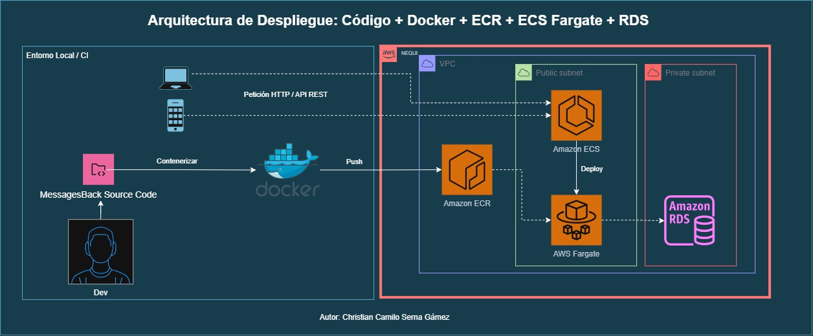

# MensajesNequi – Message Processing API (arquitectura por capas)

API RESTful para recibir, validar, procesar y consultar mensajes de un sistema de
chat. usa **arquitectura limpia clásica por capas** (controladores / servicios /
repositorios) **"Separar responsabilidades (controladores,
servicios, repositorios), usando inyección de dependencias donde es apropiado,
seguiendo principios SOLID"*.



[Referencia AWS https://builder.aws.com](https://builder.aws.com/content/2kWxLURWQxbU7JalfjyYkSgxqOs/deploy-containerized-apache-application-on-ecs-using-ecr)

## Tabla de contenido

- [Descripción general](#descripción-general)
- [Arquitectura](#arquitectura)
- [Comparación con la versión hexagonal](#comparación-con-la-versión-hexagonal)
- [Stack tecnológico](#stack-tecnológico)
- [Configuración e instalación](#configuración-e-instalación)
- [Ejecución](#ejecución)
- [Documentación de la API](#documentación-de-la-api)
- [Pruebas](#pruebas)
- [Docker / Podman](#docker--podman)
- [Alcance: qué SÍ y qué NO tiene este proyecto](#alcance-qué-sí-y-qué-no-tiene-este-proyecto)

## Descripción general

El servicio expone:

1. **`POST /api/messages`**: valida el formato del mensaje, filtra contenido
   inapropiado (censura simple por lista de palabras) y calcula metadatos
   (`word_count`, `character_count`, `processed_at`) antes de almacenarlo.
2. **`GET /api/messages/{session_id}`**: mensajes de una sesión, con
   paginación (`limit`/`offset`) y filtro opcional por remitente (`sender`).
3. **`GET /api/messages/search`** (punto extra): búsqueda de mensajes por
   contenido — incluye los que tienen una palabra censurada.
4. **`WS /ws/messages/{session_id}`** (punto extra): notifica en tiempo real
   los mensajes nuevos de una sesión.

Además incluye rate limiting (punto extra) y soporte Docker/Podman (punto
extra), incluye autenticación básica.

## Arquitectura

Capas técnicas clásicas — cada carpeta agrupa código por **tipo de
responsabilidad**, no por caso de uso:

```
app/
├── api/routes/          # Controladores HTTP: parsean la request y arman la respuesta
│   └── messages.py      # (no contienen lógica de negocio)
├── services/              # Casos de uso / reglas de negocio
│   ├── message_service.py      # pipeline: validar -> filtrar -> enriquecer -> guardar
│   └── profanity_filter.py     # filtrado simple de palabras inapropiadas
├── repositories/           # Único lugar que conoce SQLAlchemy
│   └── message_repository.py
├── models/                 # Entidades ORM (persistencia)
│   └── message.py
├── schemas/                # Contratos Pydantic de entrada/salida
│   └── message.py
├── core/                    # Infraestructura transversal
│   ├── config.py            # Settings (pydantic-settings, .env)
│   ├── database.py          # Fábrica de engine/sesión SQLAlchemy
│   ├── dependencies.py      # Cableado de inyección de dependencias
│   ├── exceptions.py        # Excepciones -> códigos HTTP
│   └── rate_limit.py        # Middleware de rate limiting
└── main.py                  # App factory: middlewares, rutas, manejo de errores
```

**Separación de responsabilidades (SOLID):**

- Los **controladores** (`api/routes`) solo traducen HTTP ↔ esquemas
  Pydantic.
- Los **servicios** (`services`) contienen las reglas de negocio y no
  conocen FastAPI ni SQLAlchemy.
- El **repositorio** (`repositories/message_repository.py`) es el único
  punto de acceso a datos, con métodos de negocio (`list_by_session`,
  `search`) en vez de un CRUD genérico.
- La **inyección de dependencias** (`core/dependencies.py`) ensambla estas
  piezas en tiempo de request vía `Depends` de FastAPI.

**Jutificación arquitectura** Porque para el alcance real del
reto (3 endpoints, un solo motor de datos, un desarrollador) **esta es la
arquitectura** que cumple el enunciado al pie de la letra, es más
fácil de revisar por un evaluador, y no paga el costo de abstracciones que
nadie va a usar. La versión hexagonal se justifica cuando aparece una
necesidad *real* de aislar casos de uso entre sí, o de
soportar más de un adaptador concreto por puerto.

## Stack tecnológico

- Python 3.10+ (probado con 3.12)
- FastAPI
- SQLAlchemy 2.0 + SQLite
- Pydantic v2 / pydantic-settings
- Pytest + pytest-cov

## Configuración e instalación

```bash
cd MensajesNequi
python -m venv .venv
source .venv/Scripts/activate      # Windows (Git Bash)
# .venv\Scripts\Activate.ps1       # Windows (PowerShell)

pip install -r requirements-dev.txt
cp .env.example .env               # opcional
```

## Ejecución

```bash
uvicorn app.main:app --reload
```

- Swagger UI: `http://127.0.0.1:8000/docs`
- ReDoc: `http://127.0.0.1:8000/redoc`
- Health check: `GET /health`

La base de datos SQLite se crea automáticamente en `./data/messages.db` al
arrancar la aplicación.

## Documentación de la API

Todas las respuestas siguen el mismo sobre:

```json
// éxito
{ "status": "success", "data": { ... } }
// error
{ "status": "error", "error": { "code": "...", "message": "...", "details": "..." } }
```

### `POST /api/messages`

**Request**

```json
{
  "message_id": "msg-123456",
  "session_id": "session-abcdef",
  "content": "Hola, ¿cómo puedo ayudarte hoy?",
  "timestamp": "2023-06-15T14:30:00Z",
  "sender": "system"
}
```

| Campo        | Tipo   | Requerido | Notas                                   |
|--------------|--------|-----------|------------------------------------------|
| message_id   | string | sí        | Único; un duplicado devuelve `409`      |
| session_id   | string | sí        |                                          |
| content      | string | sí        | 1-5000 caracteres, no solo espacios      |
| timestamp    | string | sí        | ISO-8601 (acepta sufijo `Z`)             |
| sender       | string | sí        | `"user"` o `"system"`                    |

**Respuesta `201 Created`**

```json
{
  "status": "success",
  "data": {
    "message_id": "msg-123456",
    "session_id": "session-abcdef",
    "content": "Hola, ¿cómo puedo ayudarte hoy?",
    "original_content": "Hola, ¿cómo puedo ayudarte hoy?",
    "timestamp": "2023-06-15T14:30:00Z",
    "sender": "system",
    "metadata": {
      "word_count": 5,
      "character_count": 31,
      "processed_at": "2023-06-15T14:30:01.123456Z",
      "contains_filtered_content": false
    }
  }
}
```

`content` es siempre la versión segura de mostrar (censurada si hacía falta);
`original_content` conserva el texto tal como se recibió — el filtrado nunca
destruye el dato original, solo lo oculta visualmente en `content`. Ejemplo
con una palabra prohibida:

```json
{
  "content": "eso fue una ****** decision",
  "original_content": "eso fue una idiota decision",
  "metadata": { "contains_filtered_content": true, "...": "..." }
}
```

Si el contenido incluye una palabra de la lista de palabras prohibidas
(`app/core/config.py`, campo `banned_words`), esta se censura con asteriscos
en `content` y `metadata.contains_filtered_content` queda en `true`.

**Errores posibles**

| Código HTTP | `error.code`            | Causa                                         |
|-------------|--------------------------|------------------------------------------------|
| 422         | `INVALID_FORMAT`         | Campo faltante, tipo inválido, `sender` inválido, etc. |
| 409         | `DUPLICATE_MESSAGE_ID`   | Ya existe un mensaje con ese `message_id`      |
| 429         | `RATE_LIMIT_EXCEEDED`    | Se superó el límite de solicitudes             |
| 500         | `INTERNAL_SERVER_ERROR`  | Error inesperado del servidor                  |

### `GET /api/messages/{session_id}`

| Parámetro | Tipo   | Default | Notas                          |
|-----------|--------|---------|----------------------------------|
| limit     | int    | 20      | 1-100                            |
| offset    | int    | 0       | ≥ 0                               |
| sender    | string | (todos) | `"user"` o `"system"`            |

Si la sesión no existe, devuelve `200` con una lista vacía.

### `GET /api/messages/search` (punto extra)

Busca mensajes cuyo texto contenga lo dado (`q`), sin distinguir
mayúsculas/minúsculas. Acepta `limit`/`offset`.

Busca sobre `original_content` (el texto real), no sobre `content` (la
versión censurada): si buscara sobre `content`, una palabra prohibida jamás
podría encontrarse, porque ya no existe ahí. La respuesta sigue devolviendo
`content` censurado como siempre — buscar por la palabra prohibida no la
"destapa" en el resultado.

### `WS /ws/messages/{session_id}` (punto extra)

Notifica en tiempo real los mensajes nuevos de una sesión. Cada
`POST /api/messages` exitoso con ese `session_id` se reenvía como un frame
JSON con el mismo cuerpo que devolvería la API REST (`content` censurado,
`original_content` disponible) — sin el sobre `{"status", "data"}`, porque el
WebSocket ya es en sí mismo el canal de eventos.

```bash
# ejemplo con websocat (o cualquier cliente WS)
websocat "ws://127.0.0.1:8000/ws/messages/session-abcdef"
```

O en la consola del navegador:

```js
const ws = new WebSocket("ws://127.0.0.1:8000/ws/messages/session-abcdef");
ws.onmessage = (event) => console.log(JSON.parse(event.data));
```

### `GET /health`

Chequeo de salud simple.

## Pruebas

```bash
pytest
```

`pyproject.toml` exige **mínimo 80% de cobertura** (`--cov-fail-under=80`);
el proyecto está en ~97%.

- `tests/unit/`: prueban `ProfanityFilter`, `MessageRepository`,
  `MessageService` y los esquemas Pydantic de forma aislada.
- `tests/integration/`: prueban los endpoints reales vía `TestClient` de
  FastAPI (casos felices, validación, duplicados, paginación, filtros, rate
  limiting).

Cada test usa una base de datos SQLite propia en un archivo temporal.

## Docker / Podman

```bash
podman build -t mensajesnequi .
podman run --rm -p 8000:8000 -v "$(pwd)/data:/app/data:Z" mensajesnequi
# o con docker: docker build / docker run (mismos flags, sin :Z en Windows/macOS)
```

```bash
podman compose up --build   # o: docker compose up --build
```

## Alcance: qué SÍ y qué NO tiene este proyecto

✅ Incluido (lo obligatorio del PDF + extras): mensajes/consulta/búsqueda,
WebSocket en tiempo real, manejo de errores, rate limiting, Docker/Podman,
tests ≥80%, propuesta de IaC en AWS CDK, autenticación por API key.
